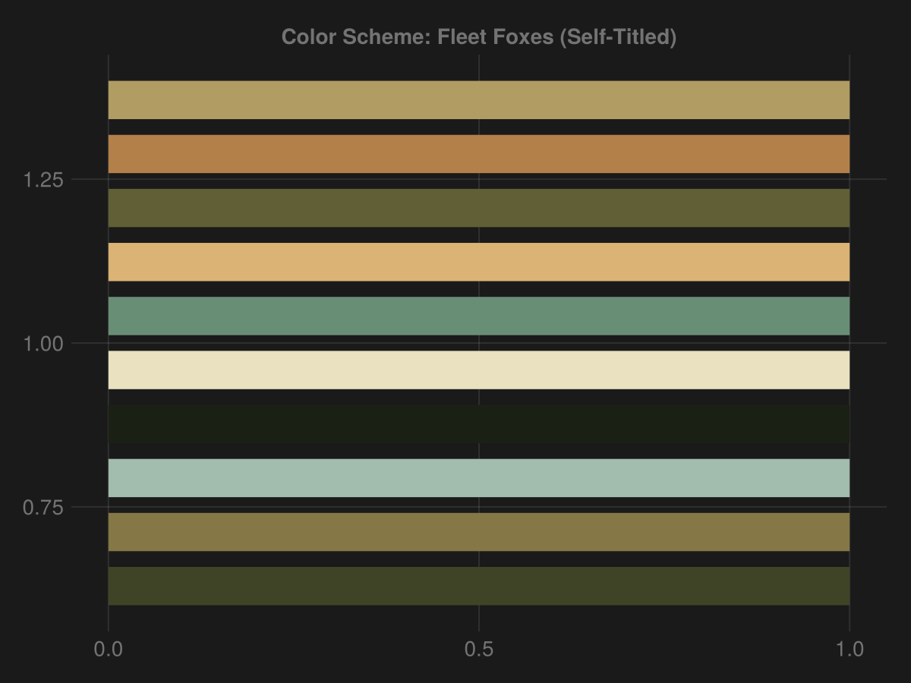
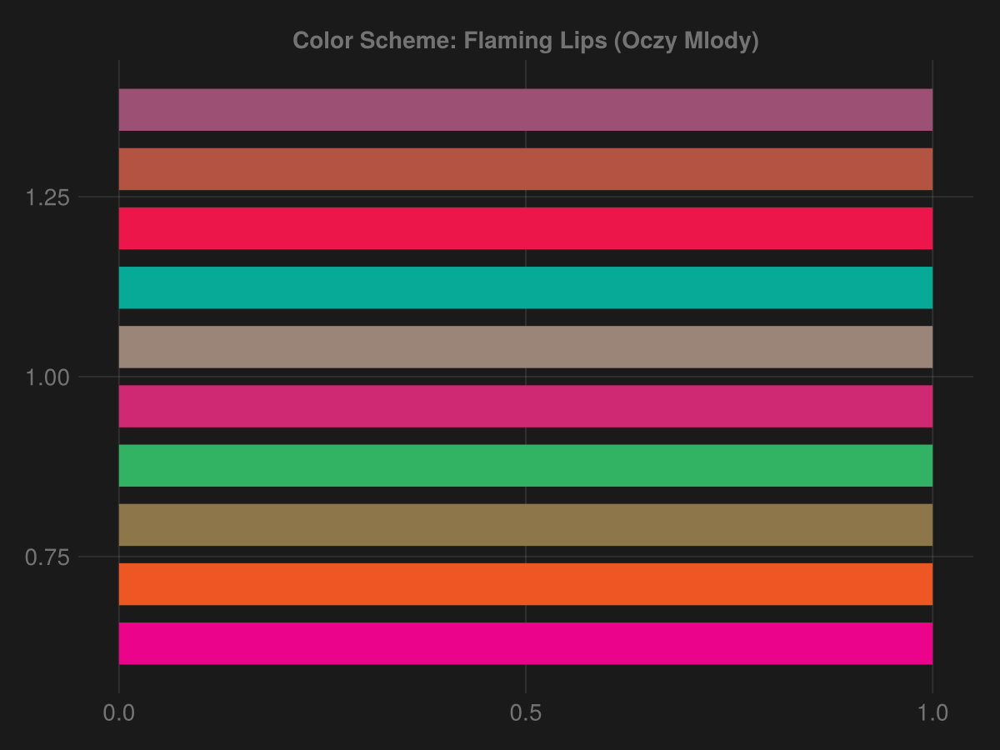

# AlbumCoverColors
frankiethull

### Welcome to AlbumCoverColors.jl

#### feel free to open issues recommending other albums and I will add the color scheme!

*this is my first attempt at building a Julia package, which is why I
chose a spin-off project off prior knowledge. originally was going to
build a Julia package to mirror this R library:
(BobRossColors)\[https://github.com/frankiethull/BobRossColors\].*

*But chose to explore different color palettes ideas, or color schemes,
for fun.*

*additionally, most all of the work was done from a terminal in a
RStudio IDE lol. Spaced across a month, spent three or four sessions of
10-minutes to get this built.*

**this package contains the colors associated with the album cover art,
the pkg depends on Colors.jl and ColorSchemes.jl. this repo used
ColorSchemeTools.jl, to ‘scrape’ colors from images & the images are
album covers**

By building with ColorSchemes.jl dependencies, this should work with
both Makie.jl and TidierPlots.jl, which creating something compatible
with TidierPlots.jl was the whole goal.

###### installing

FYI this is entirely experimental
for my own fun.
Pkg.add(url="https://github.com/frankiethull/AlbumCoverColors.jl")

``` {julia}
using ColorSchemes
using AlbumCoverColors
using TidierPlots
using DataFrames
```

stuff in the pkg:

``` {julia}
names(AlbumCoverColors, all=true)
```

data to plot:

``` {julia}
df = DataFrame(
  col = [1:1:10;],
  height = 1
)
```

### Fleet Foxes (Self-Titled)

``` {julia}
# schemes are accessed thru the pkg like so:
AlbumCoverColors.fleetfoxes
# or
#AlbumCoverColors.fleetfoxes.colors
```

``` {julia}
ggplot(df) + 
    geom_col(@aes(height, height, color = col), 
        position = "dodge", direction = "x") + 
  labs(title = "Color Scheme: Fleet Foxes (Self-Titled)") + 
  scale_color_discrete(palette = AlbumCoverColors.fleetfoxes) + 
  theme_dark()
```



### Flaming Lips \| Oczy Mlody

``` {julia}
ggplot(df) + 
    geom_col(@aes(height, height, color = col), 
        position = "dodge", direction = "x") + 
  labs(title = "Color Scheme: Flaming Lips (Oczy Mlody)") + 
  scale_color_discrete(palette = AlbumCoverColors.oczymlody) + 
  theme_dark()
```


